# 实训报告（二）

## 1、任务分析

本次任务旨在基于GitHub的分布式协同软件开发平台以小组开发的方式利用开源软件将原有开源项目进行扩充与修改，使其成为有创意、上规模、高质量的软件系统。

1、创建开发小组确定开发目标并分配开发任务

2、使用Github平台进行分支开发与集成

3、使用Github平台自动规范检查与测试

4、使用Maven框架对软件项目进行管理

5、使用DevOps软件开发流程进行开发

## 2、任务计划与分工

### 1、创建开发小组并针对样例代码工程进行小组讨论确定功能需求点

1.创建5人开发小组，付钰豪作为组长，负责组织、协调和领导团队开发；

2.所有小组成员按操作步骤在Gitee开发平台上加入同一小组，共用同一代码仓库；

3.小组讨论后决定增加以下功能点：

***\*一个房间里可以存放任意数量的物件\****，每个物件可以有一个描述和一个重量值，玩家进入一个房间后，可以通过“look”命令查看当前房间的信息以及房间内的所有物品信息；

***\*在游戏中实现一个“back”命令\****：玩家输入该命令后会把玩家带回上一个房间；

***\*在游戏中实现一个更高级的“back”命令\****：重复使用它就可以逐层回退几个房间，直到把玩家带回到游戏的起点；

***\*在游戏中增加具有传输功能的房间\****：每当玩家进入这个房间，就会被随机地传输到另一个房间；

***\*在游戏中新建一个独立的Player类用来表示玩家，并实现下列功能需求：\****

一个玩家对象应该保存玩家的姓名等基本信息，也应该保存玩家当前所在的房间；

玩家可以随身携带任意数量的物件，但随身物品的总重量不能操过某个上限值；

在游戏中增加两个新的命令“take”和“drop”，使得玩家可以拾取房间内的指定物品或丢弃身上携带的某件或全部物品，当拾取新的物件时超过了玩家可携带的重量上限，系统应给出提示；

***\*在游戏中增加一个新的命令“items”\****：可以打印出当前房间内所有的物件及总重量，以及玩家随身携带的所有物件及总重量；

在某个或某些房间中随机增加一个magic cookie（魔法饼干）物件，并增加一个“eat cookie”命令，如果玩家找到并吃掉魔法饼干，就可以增长玩家的负重能力；

***\*增加数据库功能，用于保存游戏状态和用户设置；\****

 

 

### 2、基于Github中的issue管理功能明确工作任务并为组员分配工作任务

***\*付钰豪：\****在游戏中新建一个独立的Player类用来表示玩家,建立item类用于表示物品，使得一个房间里可以存放任意数量的物件。在某个或某些房间中随机增加一个magic cookie（魔法饼干）物件，并增加一个“eat cookie”命令，如果玩家找到并吃掉魔法饼干，就可以增长玩家的负重能力；

***\*吴述伟：\****每个物件可以有一个描述和一个重量值，玩家进入一个房间后，可以通过“look”命令查看当前房间的信息以及房间内的所有物品信息；在游戏中增加一个新的命令“items”, 可以打印出当前房间内所有的物件及总重量，以及玩家随身携带的所有物件及总重量；

***\*詹晶：\****在游戏中实现一个“back”命令，玩家输入该命令后会把玩家带回上一个房间；在游戏中实现一个更高级的“back”命令，重复使用它就可以逐层回退几个房间，直到把玩家带回到游戏的起点；在游戏中增加具有传输功能的房间，每当玩家进入这个房间，就会被随机地传输到另一个房间；

***\*胡擎宇：\****在游戏中实现一个玩家对象应该保存玩家的姓名等基本信息，也应该保存玩家当前所在的房间；玩家可以随身携带任意数量的物件，但随身物品的总重量不能操过某个上限值；在游戏中增加两个新的命令“take”和“drop”，使得玩家可以拾取房间内的指定物品或丢弃身上携带的某件或全部物品，当拾取新的物件时超过了玩家可携带的重量上限，系统应给出提示；

***\*何邹翔：\****为游戏增加数据库功能，用于保存游戏状态和用户设置；

 

### 3、基于小组商定的分支模型进行软件功能开发，并按开发流程进行代码测试、提交、归并和同步

1.小组成员按照小组商定的分支模型在各自的工作分支进行进行开发任务；

2.工作分支在合并前同步到远程仓库；

3.提交代码时按照小组约定的规范格式填写代码提交说明；

### 4、代码提交到远程仓库后，应进行自动化代码格式规范检查和测试以确保功能符合需求设计

1.利用github平台的actions功能在代码提交时自动触发代码格式检查，对于不符合规范的代码系统将给出提交失败提示；

2.利用github平台的actions功能在代码提交时自动触发测试用例检查，对于不能通过测试检查的代码系统将给出提交失败提示；

 

## 3、任务成果

UML图：

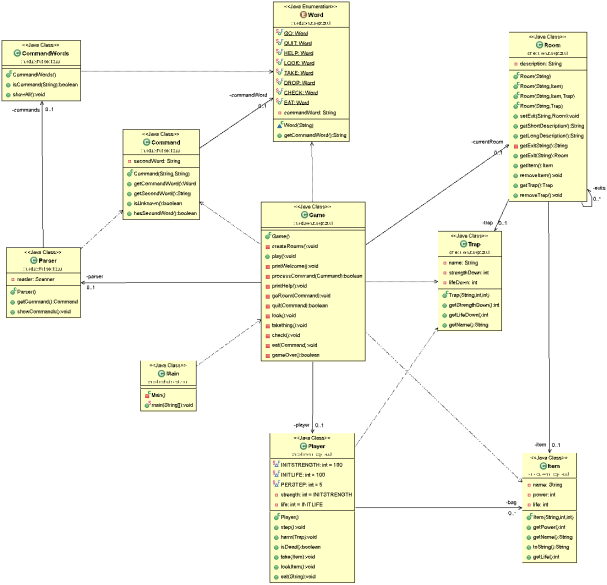 

**1、*****\*建立了item类，一个房间里可以存放任意数量的物件\****，每个物件可以有一个描述和一个重量值，玩家进入一个房间后，可以通过“look”命令查看当前房间的信息以及房间内的所有物品信息；

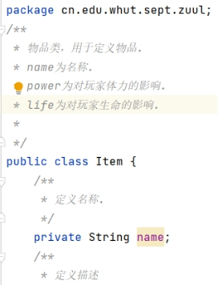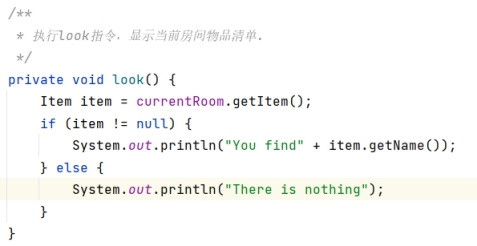 

***\*Item类和look方法\****

 

***\*2、\*******\*在游戏中实现一个“back”命令\****：玩家输入该命令后会把玩家带回上一个房间；***\*在游戏中实现一个更高级的“back”命令\****：重复使用它就可以逐层回退几个房间，直到把玩家带回到游戏的起点；***\*在游戏中增加具有传输功能的房间\****：每当玩家进入这个房间，就会被随机地传输到另一个房间；

 

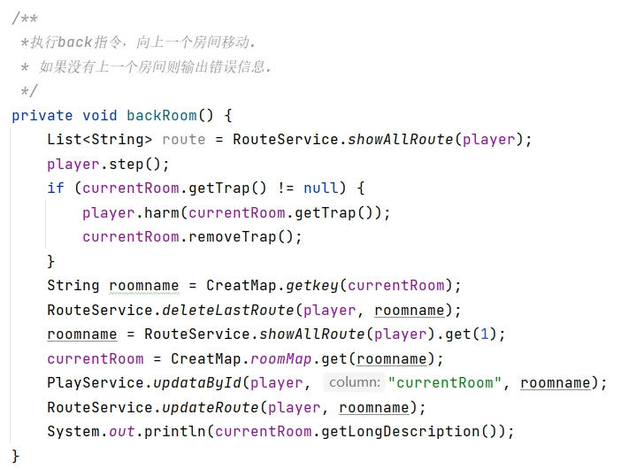 

***\*Back命令\****

 

***\*3、\*******\*在游戏中新建一个独立的Player类用来表示玩家，并实现下列功能需求：\****一个玩家对象应该保存玩家的姓名等基本信息，也应该保存玩家当前所在的房间；玩家可以随身携带任意数量的物件，但随身物品的总重量不能操过某个上限值；在游戏中增加两个新的命令“take”和“drop”，使得玩家可以拾取房间内的指定物品或丢弃身上携带的某件或全部物品，当拾取新的物件时超过了玩家可携带的重量上限，系统应给出提示；

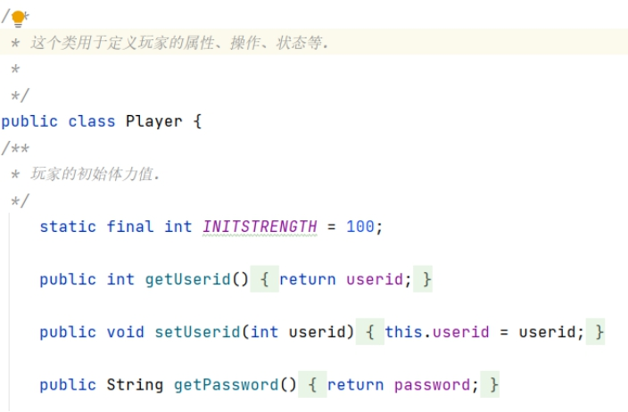 

***\*新建player类\****

 

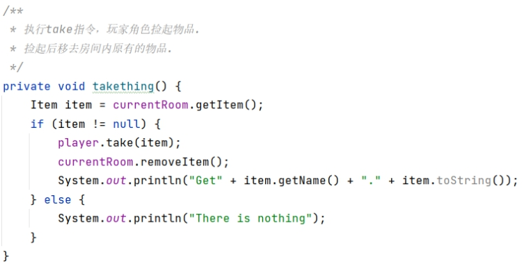 

***\*Take命令\****

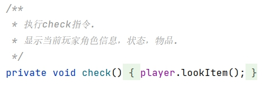 

***\*Check命令\****

 

***\*4、\*******\*在游戏中增加一个新的命令“items”\****：可以打印出当前房间内所有的物件及总重量，以及玩家随身携带的所有物件及总重量；在某个或某些房间中随机增加一个magic cookie（魔法饼干）物件，并增加一个“eat cookie”命令，如果玩家找到并吃掉魔法饼干，就可以增长玩家的负重能力；

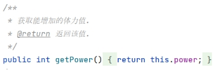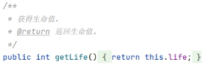 

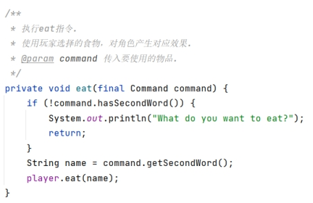 

***\*增加能量值及eat命令\****

 

***\*5、\*******\*增加数据库功能，用于保存游戏状态和用户设置；\****

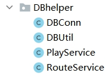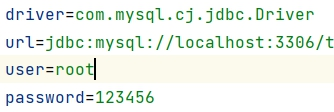 

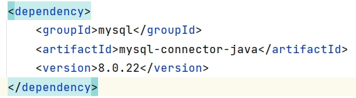 

***\*数据库功能\****

 

***\*6、增加陷阱机制\****

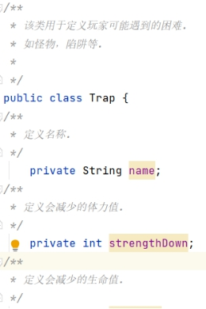 

 

***\*7、增加地图\****

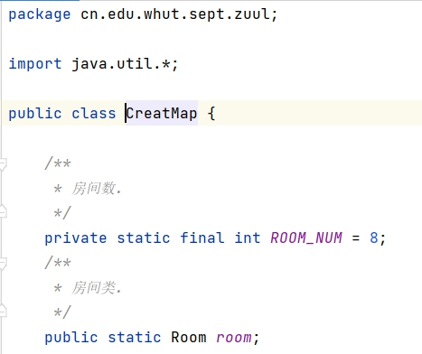

 

## 4、软件工具使用情况总结

**1.** ***\*GitHub\****

1、利用github平台建立小组并创建issue分配任务；

2、利用github平台建立个人分支进行开发任务并测试、提交、归并和同步；

3、利用github平台的actions功能在代码提交时自动触发代码格式检查，对于不符合规范的代码系统将给出提交失败提示；

4、利用github平台的actions功能在代码提交时自动触发测试用例检查，对于不能通过测试检查的代码系统将给出提交失败提示；

 

**2.** ***\*Maven\****

1、使用maven框架解决导入Java类依赖的jar包,编译Java项目主要问题；

2、解决jar包之间存在的冲突并生成单元测试报告；

3、利用maven构建项目和管理依赖，避免版本冲突等问题

 

**3.** ***\*DevOps\****

1、将项目和代码的流程标准化，具体分工，利用GitHub数据共享

2、单元测试，从代码开发、提测准入、功能回归对项目提供质量保障

3、做到测试前置，在交付给QA的代码，是保证高质量的。

4、利用项目管理工具，使项目的各阶段效率数据化

5、研发人员来做测试，进一步提高研发自测的效率和质量

 

 

## 5、过程问题记录和分析

***\*1、一个房间里可以存放任意数量的物件\****，每个物件可以有一个描述和一个重量值，玩家进入一个房间后，可以通过“look”命令查看当前房间的信息以及房间内的所有物品信息；

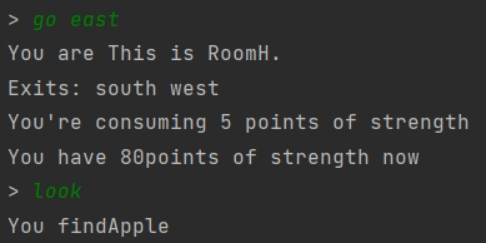 

***\*Look方法\****

 

***\*2、\*******\*在游戏中实现一个“back”命令\****：玩家输入该命令后会把玩家带回上一个房间；***\*在游戏中实现一个更高级的“back”命令\****：重复使用它就可以逐层回退几个房间，直到把玩家带回到游戏的起点；***\*在游戏中增加具有传输功能的房间\****：每当玩家进入这个房间，就会被随机地传输到另一个房间；

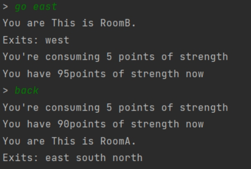 

***\*back方法\****

 

**1、*****\*在游戏中新建一个独立的Player类用来表示玩家，并实现下列功能需求：\****一个玩家对象应该保存玩家的姓名等基本信息，也应该保存玩家当前所在的房间；玩家可以随身携带任意数量的物件，但随身物品的总重量不能操过某个上限值；在游戏中增加两个新的命令“take”和“drop”，使得玩家可以拾取房间内的指定物品或丢弃身上携带的某件或全部物品，当拾取新的物件时超过了玩家可携带的重量上限，系统应给出提示；

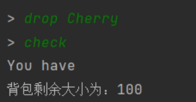 

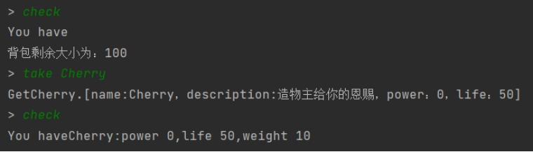 

***\*Take&Drop方法\****

 

**2、*****\*在游戏中增加一个新的命令“items”\****：可以打印出当前房间内所有的物件及总重量，以及玩家随身携带的所有物件及总重量；在某个或某些房间中随机增加一个magic cookie（魔法饼干）物件，并增加一个“eat cookie”命令，如果玩家找到并吃掉魔法饼干，就可以增长玩家的负重能力；

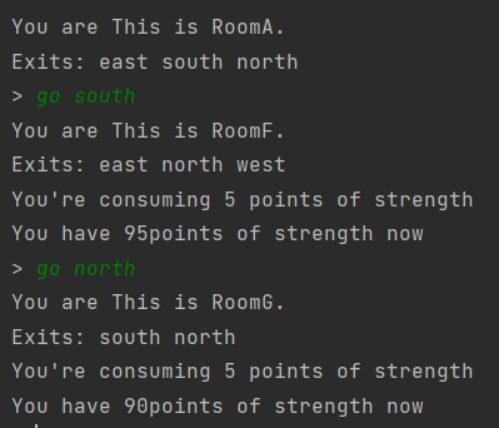 

***\*房间位置和信息\****

 

***\*6、\*******\*增加数据库功能，用于保存游戏状态和用户设置；\****

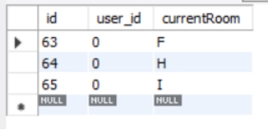 

***\*数据库所存储的玩家信息\****
