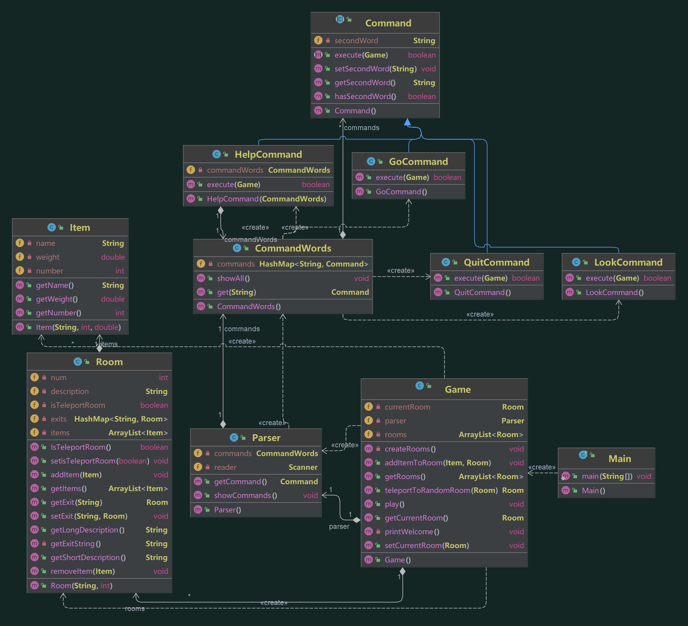
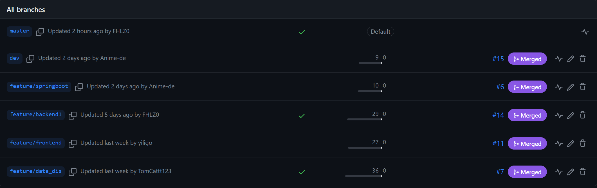
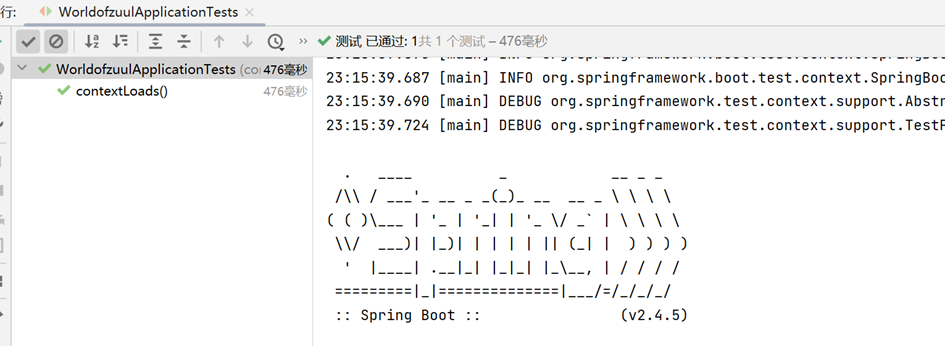

# 实践报告（二）
***
## 一、任务分析
本次实践基于巩固强化软件编程规范、提高面向对象软件建模与抽象能力、培养小组协同开发能力
、掌握基于Maven的软件项目管理机制、掌握基于Github的小组协同开发工具和平台、了解DevOps软件开发流程等任务目的进一步培养小组开发以及GitHub工具使用情况。
### 具体内容
* 创建软件开发小组
* 针对样例代码工程进行小组讨论，确定功能扩充需求点
* 基于Github中的issue管理功能明确工作任务并为组员分配工作任务
* 基于小组商定的分支模型进行软件功能开发，并按开发流程进行代码测试、提交、归并和同步
* 代码提交到远程仓库后，应进行自动化代码格式规范检查和测试以确保功能符合需求设计
* 完成前述各项任务后，可尝试进行代码自动化打包，自动生成可供执行的jar文件

## 二、开发计划
本次实践的具体任务是实现一个半开发状态的游戏项目，通过利用Springboot框架接口实现前端与后端接口的匹配，实现对项目的web图形化。增加数据库管理功能，对各个房间及用户状态的游戏相关信息保存管理。补充后端代码实现多个游戏开发功能，并完善已有代码格式。同时利用maven编译脚本测试用例。
### 功能确认
* **look功能** 玩家输入look命令后能够查看当前房间的相关信息以及房间内所存放物品的信息
* **back功能** 玩家输入back命令后会把玩家带回上一个房间
* **连续back功能** 重复输入back命令后就可以逐层回退几个房间，直至把玩家带回起点
* **随机传送功能** 设置某个房间属性为传送房间，当玩家进入这个房间，就会被随机地传送到另一个房间
* **数据存档功能** 添加数据库保存当前用户游戏状态及用户设置
* **图形化界面**  添加前端web界面，用户可以在网页上操作角色，并执行相应功能
### 任务分配
* **前端代码编写——岳义力**
  * 前端页面开发，房间、物品和动画特效制作、实现用户交互功能
* **回退功能与存档模块——彭鑫**
  * 实现回退一步和回退多步的功能，同时编写数据库，对玩家信息进行存储，搭建Springboot框架
* **查看和随机传送模块——熊雪峰**
  * 用户可以在房间存放任意数量物品，同时可以查看，增加具有传送功能的房间
* **代码审查与持续继承——尹家祥**
  * 对pull request到GitHub远程仓库开发分支的代码进行审查和批改，编写action功能实现代码持续继承，并制作PPT
### 操作流程
1. 分组完成后，小组分配成员具体完成任务，并基于Github中的issue管理功能明确工作任务，同时发布各成员具体工作
2. 代码提交至远程仓库，在GitHub远程仓库中的actions编写相应的自动化代码格式规范化检查及测试，为后续代码提交做好准备
3. 除master主分支外，另外创建1个dev分支作为开发分支，4个feature特性分支作为各成员功能实现分支。各成员在完成各自功能后提交并推送至远程仓库由平台审查无误后合并至dev开发分支
4. 在代码审查和测试均无误后，将开发分支dev集成至master主分支中，并发布可执行版本文件

## 三、开发实现
### 开发计划
#### 1.系统设计
* 基于此我们设计出了后端由Java Springboot提供网络服务，继承了网络API和随机传送、房间回退等业务逻辑，前端由服务器桥接层使用Node JS和Vue架构来对页面进行管理和布局；浏览器端负责对HTML文件进行渲染和Ajax数据加载的系统框架。

#### 2.接口设计
* 通过将后端命令功能API接口化，使前端页面能够通过访问接口的方式触发命令。网页端通过提出get/post请求向服务器端提出访问，服务器端则通过接口返回相应的信息，从而实现后端功能的可视化。

#### 3.项目管理设计
* 在项目的生命周期管理，代码的编译、测试等方面通过引入maven对整个项目进行管理，同时对提交的代码进行测试，实现自动化布局。在版本管理上采用git命令灵活地控制版本，以便对项目进行更强地迭代开发。同时在gihub为我们提供了良好的项目管理工作，通过actions创建自动化工作流使我们能够托管代码。

#### 4.分工化设计
* 项目工作量不低，在仓库里创建多个特性分支利于我们良好地通过不断地更新迭代，有条不紊地进行着各自任务，而不至于在一个分支上同时工作造成的系统紊乱等问题。master作为我们的主分支以及发布分支，在开发过程中每个开发分支集中到dev分支上，最后由dev分支集成到master分支进行发布。

#### 5.审查与测试
* 作为一个项目而言，小组中的提交次数绝不会低，为避免提交的代码不具有很好的执行力和规范性，一个良好的自动化审查与测试工具必不可少，通过编写maven脚本再结合actions自动化，可以在代码提交至远程仓库时及时对代码审查与测试，通过测试的分支代码才能够合并至目标分支，实现开发功能。

### 开发流程
#### 1.分配任务
* 创建issue房间
 
####  2.新增look功能，新增物品goods类，增加传送房间功能
* 新增goods类
```java
public class Goods {
    private int id;   //物品ID
    private String name;  //物品名称
    private Integer weight;  //物品权重
    private Integer roomId;  //物品所属房间id

    public Goods() {
    }
    public Goods(String name, Integer weight, Integer roomId) {
        this.name = name;
        this.weight = weight;
        this.roomId = roomId;
    }
    public Integer getRoomId() {
        return roomId;
    }
    public void setRoomId(Integer roomId) {
        this.roomId = roomId;
    }
    public String getName() {
        return name;
    }
    public void setName(String name) {
        this.name = name;
    }
    public Integer getWeight() {
        return weight;
    }
    public void setWeight(Integer weight) {
        this.weight = weight;
    }
}
```
* 新增look接口
```java
@RestController
@RequestMapping("/bag")
public class BagController {
    @Autowired
    private Game game;
    @Autowired
    private GoodsMapper goodsMapper;

    @GetMapping("/look")
    public Result look() {
        // 判断游戏是否初始化
        if (!game.checkIsInit()) {
            return new Result(false, "游戏未初始化");
        }

        // 1、获取当前房间的id
        Integer currentRoomId = game.getCurrentRoomId();

        // 2、查找当前房间的物品
        LambdaQueryWrapper<Goods> lqw = new LambdaQueryWrapper<>();
        lqw.eq(Goods::getRoomId, currentRoomId);
        List<Goods> goodsList = goodsMapper.selectList(lqw);

        if (goodsList == null) {
            return new Result(false);
        }
        return new Result(true, "成功", goodsList);
    }
}
```
* Room类中新增isTransport属性，game中为传送房间传送至随机房间
```
public Room TransportTorandom(Room currentroom){
        List<Room> aviliablerooms  = roomList;
        for(Room room:roomList){
            if(!room.getIstransport())
                aviliablerooms.add(room);
        }
        int randomIndex = (int) (Math.random() * aviliablerooms.size());
        Room nextRoom = aviliablerooms.get(randomIndex);

        // 如果下一个房间是传输房间，则递归调用传输方法
        if (nextRoom.getIstransport()) {
            nextRoom = TransportTorandom(nextRoom);
        }

        return nextRoom;
    }
```
#### 3.新增back回退功能，增加数据库
* 高级back功能 
```java
@RestController
@RequestMapping("/move")
public class MoveController {
    @Autowired
    private MoveService moveService;
    @Autowired
    private Game game;
    @GetMapping
    public Result back() {
        // 判断游戏是否初始化
        if (!game.checkIsInit()) {
            return new Result(false, "游戏未初始化");
        }
        // 获取上一个房间的id
        int preRoomId = game.backPreRoom();
        if (preRoomId == -1) {
            return new Result(false, "已返回至起点");
        }
        game.setCurrentRoomId(preRoomId);
        return new Result(true, "成功", preRoomId);
    }
}
```
* 新增数据库
```sql
SET NAMES utf8mb4;
SET FOREIGN_KEY_CHECKS = 0;

-- ----------------------------
-- Table structure for goods
-- ----------------------------
DROP TABLE IF EXISTS `goods`;
CREATE TABLE `goods`  (
  `id` int(11) NOT NULL,
  `name` varchar(255) CHARACTER SET utf8 COLLATE utf8_general_ci NULL DEFAULT NULL,
  `weight` int(11) NULL DEFAULT NULL,
  `room_Id` int(11) NULL DEFAULT NULL,
  PRIMARY KEY (`id`) USING BTREE,
  INDEX `foreign_key_1`(`room_Id`) USING BTREE,
  CONSTRAINT `foreign_key_1` FOREIGN KEY (`room_Id`) REFERENCES `room_info` (`id`) ON DELETE NO ACTION ON UPDATE SET NULL
) ENGINE = InnoDB CHARACTER SET = utf8 COLLATE = utf8_general_ci ROW_FORMAT = Dynamic;

-- ----------------------------
-- Table structure for room_info
-- ----------------------------
DROP TABLE IF EXISTS `room_info`;
CREATE TABLE `room_info`  (
  `id` int(11) NOT NULL,
  `name` varchar(255) CHARACTER SET utf8 COLLATE utf8_general_ci NULL DEFAULT NULL,
  `description` varchar(255) CHARACTER SET utf8 COLLATE utf8_general_ci NULL DEFAULT NULL,
  PRIMARY KEY (`id`) USING BTREE
) ENGINE = InnoDB CHARACTER SET = utf8 COLLATE = utf8_general_ci ROW_FORMAT = Dynamic;
```
```sql
-- ----------------------------
-- Records of goods
-- ----------------------------
INSERT INTO `goods` VALUES (0, '无尽之刃', 18, 3);
INSERT INTO `goods` VALUES (1, '死亡之爪', 39, 8);
INSERT INTO `goods` VALUES (2, '红水晶', 41, 1);
INSERT INTO `goods` VALUES (3, '三相之力', 43, 2);
INSERT INTO `goods` VALUES (4, '破败之刃', 23, 2);
INSERT INTO `goods` VALUES (5, '龙息', 74, 6);
INSERT INTO `goods` VALUES (6, '多兰盾', 98, 1);
INSERT INTO `goods` VALUES (7, '猫', 27, 3);
INSERT INTO `goods` VALUES (8, '狗', 73, 0);
INSERT INTO `goods` VALUES (9, '苹果', 51, 0);
INSERT INTO `goods` VALUES (10, '梨子', 21, 6);
INSERT INTO `goods` VALUES (11, '魔法书', 33, 3);
INSERT INTO `goods` VALUES (12, '鸭子', 92, 0);
INSERT INTO `goods` VALUES (13, '巨神之锤', 83, 1);
INSERT INTO `goods` VALUES (14, '篮球', 13, 8);
INSERT INTO `goods` VALUES (15, '足球', 99, 8);
```
```sql
-- ----------------------------
-- Records of room_info
-- ----------------------------
INSERT INTO `room_info` VALUES (0, 'garden', '花园');
INSERT INTO `room_info` VALUES (1, 'classroom', '教室');
INSERT INTO `room_info` VALUES (2, 'canteem', '食堂');
INSERT INTO `room_info` VALUES (3, 'office', '办公室');
INSERT INTO `room_info` VALUES (4, 'lobby', '大堂');
INSERT INTO `room_info` VALUES (5, 'playground', '操场');
INSERT INTO `room_info` VALUES (6, 'dorm', '宿舍');
INSERT INTO `room_info` VALUES (7, 'gate', '校门');
INSERT INTO `room_info` VALUES (8, 'trainingroom', '训练室');

SET FOREIGN_KEY_CHECKS = 1;
```
4. 代码与版本优化
   * 旧版本只实现了基础的后端开发版本，其类图
   
   * 新版本采用数据包对类之间进行新封装
   
5. 分支模型与代码审查
   * 分支模型
   
   * 审查通过并合并
    
   * 审查不通过
   
   * actions审查与自动集成过程
   
6. 项目发布类间关系分析
   * Game类：这是游戏的主类，负责创建和初始化游戏的各个组件，包括房间、解析器等。它还包含了一些方法，如初始化当前房间ID、创建房间、进入下一个房间等。
   * Direction类：这是一个辅助类，定义了四个方向常量：东、西、南、北，分别用整数表示。
   * Params类：这是一个参数类，用于存储房间和类型信息。
   * Result类：这是一个结果类，用于封装操作的结果，包括操作是否成功、提示消息和返回的数据。
   * Goods类：这是一个物品类，表示游戏中的物品，包括物品的名称、重量和所在的房间ID等属性。
   * Room类：这是房间类，用于表示游戏中的房间。每个房间有一个唯一的ID、名称、描述以及与其他房间的连接关系（出口）。房间还可以包含一些物品。
   * RoomInfo类：这是房间信息类，是Room类的父类，包含房间的基本信息，如ID、名称和描述。
   * GoodsMapper接口：这是一个数据访问层接口，用于操作Goods对象的持久化操作。
   * RoomInfoMapper接口：这是另一个数据访问层接口，用于操作RoomInfo对象的持久化操作。
   * GameService接口：这是游戏服务接口，定义了初始化游戏的方法。
   * GoodsService接口：这是物品服务接口，用于对物品进行操作。
   * MoveService接口：这是移动服务接口，定义了游戏中的移动方法，如向东、向南、向西、向北移动以及返回上一个房间。
   * RoomInfoService接口：这是一个房间信息服务接口，定义了对房间信息进行操作的方法，如获取房间信息、更新房间信息等。
   * GameServiceImpl类：这是GameService接口的实现类，实现了游戏的初始化方法。
   * GoodsServiceImpl类：这是GoodsService接口的实现类，实现了对物品进行操作的方法。
   * MoveServiceImpl类：这是MoveService接口的实现类，实现了游戏中的移动方法。
   * RoomInfoServiceImpl类：这是RoomInfoService接口的实现类，实现了对房间信息进行操作的方法。
7. 单元测试模块
   * 旧版本测试    
   ```
   @Test
    public void testTeleportRoom() {
        // 获取传输房间
        Room trainingRoom = game.getRooms().get(8);
        Room dormitoryRoom = game.getRooms().get(6);

        assertNotNull(trainingRoom);
        assertNotNull(dormitoryRoom);

        // 测试进入传输房间后是否会随机传输到其他房间
        ArrayList<Room> teleportRooms = new ArrayList<>();
        teleportRooms.add(trainingRoom);
        teleportRooms.add(dormitoryRoom);

        for (Room room : teleportRooms) {
            Room nextRoom = game.teleportToRandomRoom(room);
            assertNotNull(nextRoom);
            assertFalse(nextRoom.IsTeleportRoom());
        }
    }
   ```
   * 新版本采用SpringbootTest测试工具，对全局命令接口进行测试
   ```
   @SpringBootTest
   class WorldofzuulApplicationTests {
    @Test
    void contextLoads() {
    }
   }
   ```
   * SpringbootTest测试结果
   

## 四、实践结果记录


